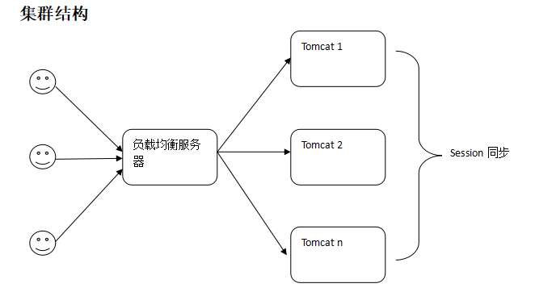

# Tomcat - 集群

## 软硬件环境

    windows 10 64bit
    tomcat 7.0 64bit
    httpd 2.4 64bit
    mod_jk 需要与 httpd 对应

### httpd
http://archive.apache.org/dist/httpd/binaries/win32/  

官网不支持直接下载 windows2.4 版本 第三方下载
http://httpd.apache.org/docs/current/platform/windows.html#down

## 集群结构
<!--  -->

集群示意图.png

### 文件结构
    > httpd
    > tomcat1
    > tomcat2

## 配置 Apache 和 mod_jk

1. 把 mod_jk.so 解压到 `httpd/conf/` 下

2. 在 `C:\cluster\httpd\conf` 目录下创建一个 `mod_jk.conf`  
mod_jk.conf
```
#加载mod_jk Module
LoadModule jk_module modules/mod_jk.so

#指定workers.properties文件路径 
JkWorkersFile conf/workers.properties

#指定那些请求交给tomcat处理,"controller"为在workers.propertise里指定的负载分配控制器名
JkMount /* controller
```

3. 在 `C:\cluster\httpd\conf` 创建一个 `workers.properties` 的文件  
workers.properties
```
#server
worker.list = controller
#========tomcat1========
#ajp13端口号，在tomcat下server.xml配置,默认8009
worker.tomcat1.port=8009

#tomcat的主机地址，如不为本机，请填写ip地址 
worker.tomcat1.host=localhost

#协议类型
worker.tomcat1.type=ajp13

#server的加权比重，值越高，分得的请求越多。lbfactor是负载平衡因数(Load Balance Factor)
worker.tomcat1.lbfactor=1

#========tomcat2========
worker.tomcat2.port=9009
worker.tomcat2.host= localhost
worker.tomcat2.type=ajp13
worker.tomcat2.lbfactor=1

#========controller,负载均衡控制器========
#负载均衡控制器类型，lbfactor是负载平衡因数(Load Balance Factor)
worker.controller.type=lb

#指定分担请求的tomcat列表
worker.controller.balanced_workers=tomcat1,tomcat2

#粘性session(默认是打开的) 当该属性值=true（或1）时，代表session是粘性的，即同一session在集群中的同一个节点上处理，session不跨越节点。在集群环境中，一般将该值设置为false
worker.controller.sticky_session=false

#设置用于负载均衡的server的session可否共享
worker.controller.sticky_session_force=1
``` 

4. 修改 `C:\cluster\httpd\conf\httpd.conf` 在其最后添加如下内容:
```
Include conf/mod_jk.conf
```

5. 前端的负载均衡服务器配置完成


## 配置 Tomcat

1. 修改 `tomcat1\conf\server.xml`  

    在配置`<Engine>`中添加 `jvmRoute="tomcat1"` ,名称 `worker.controller.balanced_workers=tomcat1,tomcat2` 对应

2. 在\<Engine\>下添加如下内容
``` xml
<Cluster className="org.apache.catalina.ha.tcp.SimpleTcpCluster" channelSendOptions="8">

    <Manager className="org.apache.catalina.ha.session.DeltaManager"
            expireSessionsOnShutdown="false"
            notifyListenersOnReplication="true"/>

    <Channel className="org.apache.catalina.tribes.group.GroupChannel">
        <Membership className="org.apache.catalina.tribes.membership.McastService"
                    address="228.0.0.4"
                    port="45564"
                    frequency="500"
                    dropTime="3000"/>
        <Receiver className="org.apache.catalina.tribes.transport.nio.NioReceiver"
                    address="auto"
                    port="4000"
                    autoBind="100"
                    selectorTimeout="5000"
                    maxThreads="6"/>

        <Sender className="org.apache.catalina.tribes.transport.ReplicationTransmitter">
            <Transport className="org.apache.catalina.tribes.transport.nio.PooledParallelSender"/>
        </Sender>
        <Interceptor className="org.apache.catalina.tribes.group.interceptors.TcpFailureDetector"/>
        <Interceptor className="org.apache.catalina.tribes.group.interceptors.MessageDispatch15Interceptor"/>
    </Channel>

    <Valve className="org.apache.catalina.ha.tcp.ReplicationValve" filter=""/>
    <Valve className="org.apache.catalina.ha.session.JvmRouteBinderValve"/>

    <Deployer className="org.apache.catalina.ha.deploy.FarmWarDeployer"
            tempDir="/tmp/war-temp/"
            deployDir="/tmp/war-deploy/"
            watchDir="/tmp/war-listen/"
            watchEnabled="false"/>

    <ClusterListener className="org.apache.catalina.ha.session.JvmRouteSessionIDBinderListener"/>
    <ClusterListener className="org.apache.catalina.ha.session.ClusterSessionListener"/>
</Cluster>
```
3. 第一个tomcat配置完成

4. 然后再修改第二个tomcat  

    修改 `C:\cluster\tomcat2\conf\server.xml` ,在配置`<Engine>`中添加 `jvmRoute="tomcat2"`,  
    名称与 `worker.controller.balanced_workers=tomcat1,tomcat2` 对应

1. 然后再 `<Engine>`下添加和 tomcat1 相同的配置:


### 注意：
因为在一台机器上部署两台 tomcat，所以需要修改第二个tomcat的端口，不然会产生冲突
```
然后修改http1.1的端口，默认是8080
<Server port="9005" shutdown="SHUTDOWN"> 默认为：8005

最后修改AJP1.3端口，默认是8009
<Connector port="9080" protocol="HTTP/1.1" connectionTimeout="20000"redirectPort="8443" /> 

这个AJP1.3的端口必须与C:\cluster\httpd\conf\ workers.properties文件中的配置保持一下
<Connector port="9009" protocol="AJP/1.3" redirectPort="8443" />
```


