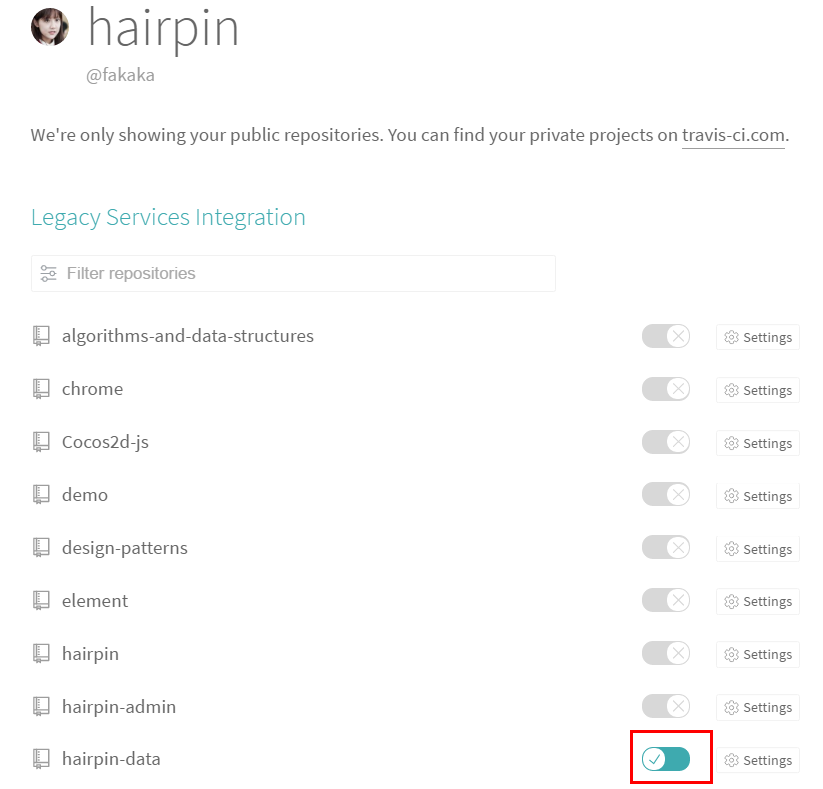
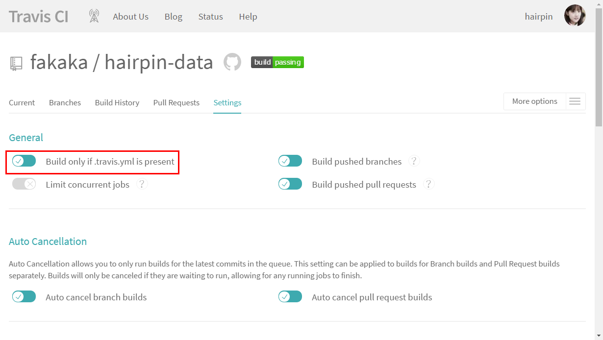
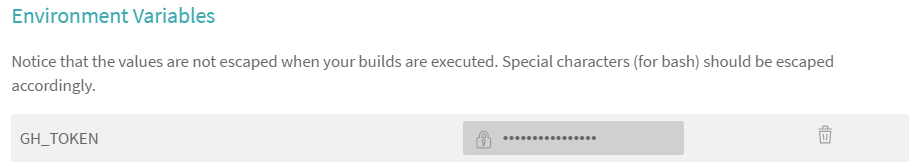
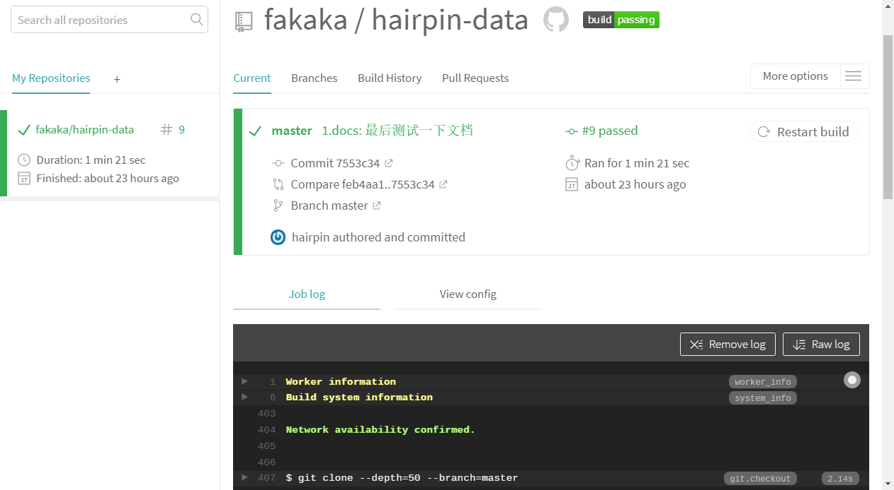
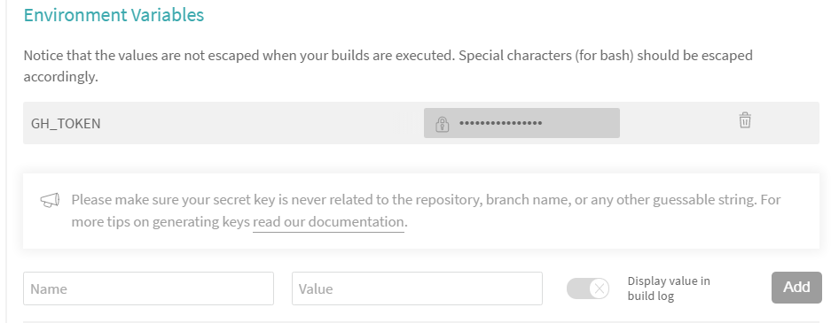

# travis-ci 简单使用

## 一、访问官网

[官网](https://travis-ci.org/) https://travis-ci.org/ 

## 二、用 GitHub 帐号登录

## 三、来到 Profile页面

1. 打开页面 https://travis-ci.org/profile/fakaka
2. 打开需要 ci 的仓库

    
    
3. 点击设置 Settings
    - Build only if .travis.yml is present 表示是否有`.travis.yml`文件时构建

    

4. 设置环境变量 Environment Variables

    例如可以设置 GH_TOKEN 

    


## 四、新建 travis-ci 的配置文件
1. 在项目根目录下建立 `.travis.yml` 文件  

node_js 样例 .travis.yml
``` yaml
language: node_js
node_js:
  - "8"
```

2. 默认的构建脚本

``` bash
npm test
```

3. 构建前 before_install  
构建前执行
``` yaml
before_install:
  - curl -o- -L https://yarnpkg.com/install.sh | bash -s -- --version version-number
  - export PATH="$HOME/.yarn/bin:$PATH"
```


## 五、测试
每次提交后会构建脚本


## 例子

> 使用 `vuepress` 生成文档并发布到到 `gh-pages` 分支

### 1. 新建 `gh-pages` 分支
新建 `gh-pages` 分支并删除旧的文件

### 2. 生成 GH_TOKEN

[参考官方文档](https://help.github.com/articles/creating-a-personal-access-token-for-the-command-line/)  
复制 Personal access tokens 

### 3. 添加环境变量

在项目的设置页面设置环境变量



### 4. 配置 .travis.yml 文件

设置构建成功后的脚本 `after_success`

.travis.yml

``` yaml
language: node_js
node_js:
  - "8"

after_success:
- git config --global user.name "hairpin"
- git config --global user.email "vsmj012@163.com"
- npm run docs:build
- cd docs/.vuepress/dist
- git init
- git add -A
- git commit -m 'deploy'
- git push -f "https://${GH_TOKEN}@${GH_REF}" master:gh-pages

env:
  global:
    - GH_REF: github.com/fakaka/hairpin-data.git
```

### 5. 测试效果


